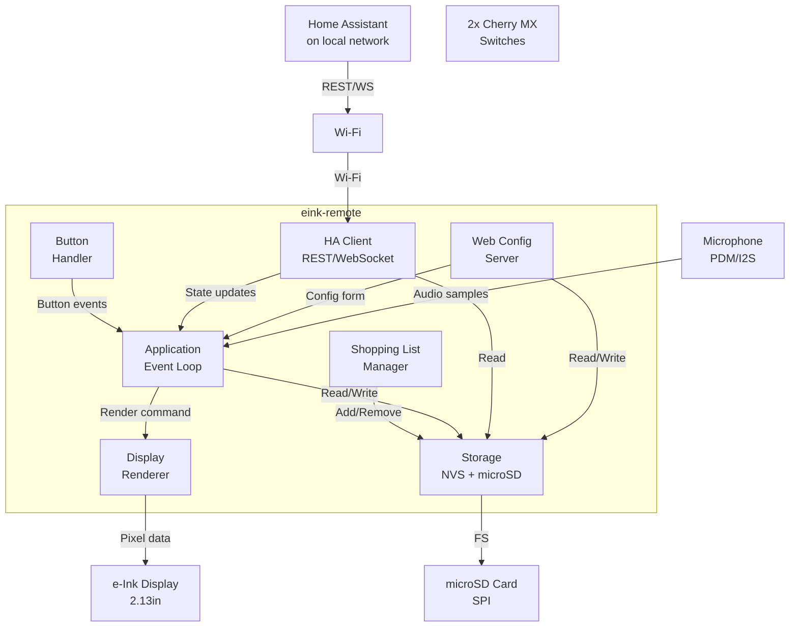
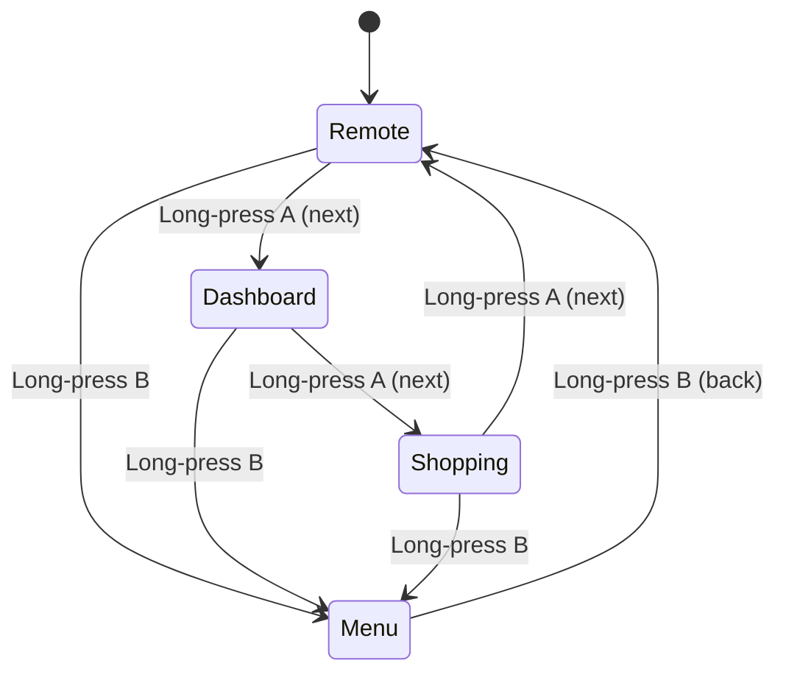
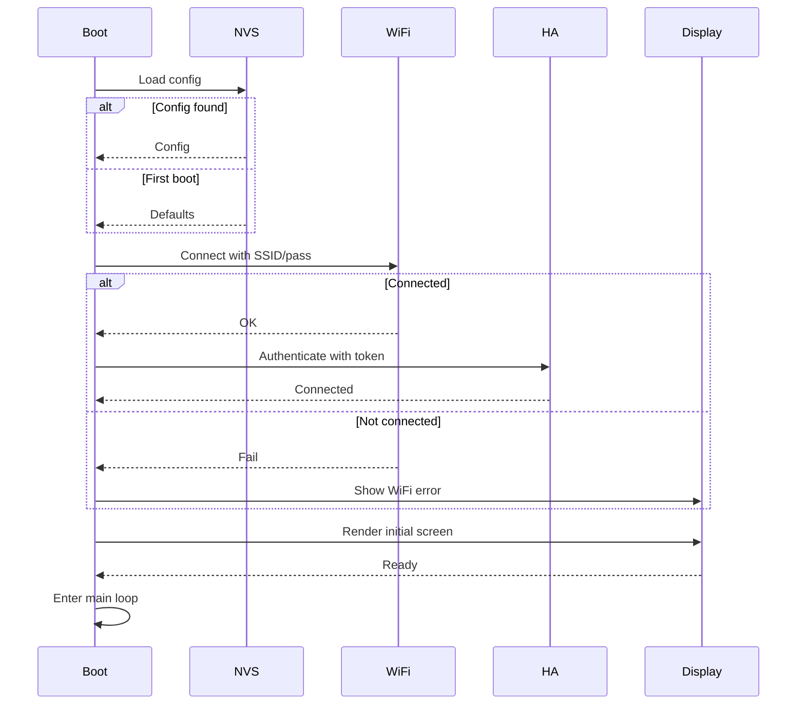

# TDD — eink-remote: Home Assistant Controller on ESP32-S3

## 1. Overview

**eink-remote** is a minimal, self-contained Home Assistant remote controller built on an ESP32-S3 with a 2.13" e-ink display, 2 mechanical buttons, microSD storage, and a microphone for voice input.

The device acts as a **local physical interface** to Home Assistant:
- Control lights, switches, and other entities
- Display live state from Home Assistant
- Maintain a shopping list
- Receive firmware updates over-the-air
- Configure settings via a local web server

It is **not** a general-purpose IoT platform. It solves one problem very well: being a fast, low-power, always-available physical remote control.

---

## 2. Hardware

**MCU:** Seeed Studio XIAO ESP32-S3
- 14 GPIO pins total
- Wi-Fi + BLE capable
- USB-C power/programming

**Display:** Waveshare 2.13" e-Paper HAT V4
- 250x122 pixel resolution
- SPI interface (6 GPIO pins)
- Low power (only draws current during refresh)

**Input:** 2x Cherry MX mechanical switches (hotswap PCB)
- GPIO interrupt-based (2 GPIO pins)
- Physical feedback (important for UX)
- Debounced in hardware (20ms)
- Short-press / long-press / double-press patterns to compensate for fewer keys

**Storage:** microSD card (SPI mode)
- Shares SPI bus with display (separate CS pin → 1 extra GPIO)
- Stores shopping list, logs, audio clips, config backups

**Microphone:** The XIAO ESP32-S3 (base version) has **no** built-in mic
- The XIAO ESP32-S3 **Sense** variant includes a PDM digital microphone + microSD slot (recommended — solves both needs with zero wiring)
- Otherwise: external I2S MEMS mic (e.g. INMP441/SPH0645, 3 GPIO pins)

**Power:** USB-C (for now; future: battery + low-power deep sleep)


#### Pin Connection

| # | HAT pin (silkscreen order) | Wire color (typical Waveshare cable) | XIAO label | XIAO GPIO | Purpose            |
| - | -------------------------- | ------------------------------------ | ---------- | --------: | ------------------ |
| 1 | VCC                        | grey/red                             | `3V3`      |         — | Power (3.3 V)      |
| 2 | GND                        | brown/black                          | `GND`      |         — | Ground             |
| 3 | DIN                        | blue                                 | `D10`      |         9 | SPI MOSI (data in) |
| 4 | CLK                        | yellow                               | `D8`       |         7 | SPI clock          |
| 5 | CS                         | orange                               | `D1`       |         2 | Chip select        |
| 6 | DC                         | green                                | `D2`       |         3 | Data/Command       |
| 7 | RST                        | white                                | `D3`       |         4 | Reset              |
| 8 | BUSY                       | purple                               | `D4`       |         5 | Busy status        |


---

## 3. Goals

### Primary

1. Build a working Home Assistant remote controller
2. Display live HA entity state on e-ink
3. Control HA lights/switches via 2 physical buttons
4. Navigate between remote, dashboard, and shopping list screens
5. Persist configuration (Wi-Fi, HA host, token) across reboot
6. Support Over-The-Air firmware updates
7. Make the UI responsive (button press → display update in <1 second)
8. Run on minimal power (e-ink refresh only when state changes)

### Secondary

- Sync shopping list with HA (optional YAML helper)
- BLE presence detection (future)
- Battery + deep sleep (future)
- Scheduled automations (future)

---

## 4. Non-Goals

- **Not** a general IoT platform (unlike the original TDD)
- **Not** replacing Home Assistant (HA remains the brain)
- **Not** building an e-reader
- **Not** supporting complex automations on-device
- **Not** providing a full dashboard (limited display size)
- **Not** cloud connectivity (local network only)

---

## 5. High-Level Architecture



---

## 6. Technology Stack

| Component | Technology | Justification |
|-----------|-----------|---------------|
| MCU | ESP32-S3 | Wi-Fi, plenty of GPIO, Waveshare support |
| Firmware | ESP-IDF | C++17, FreeRTOS, battle-tested |
| Build | PlatformIO | Cross-platform, simple CLI |
| Display Driver | ESP-IDF SPI + custom | Waveshare library (or custom) |
| Button Handler | GPIO interrupts + FreeRTOS timers | Low-power, responsive |
| HA Integration | HTTP REST (primary), WebSocket (future) | Simple, no dependencies |
| Config Storage | NVS (secrets) + microSD (shopping list, logs, audio) | Flash-backed secrets, removable bulk storage |
| Microphone | PDM (Sense variant) or I2S MEMS mic | Built-in on XIAO Sense, minimal wiring |
| Web Server | esp_http_server (built-in) | Minimal overhead |
| Language | C++17 | Modern abstractions without overhead |

---

## 7. Repository Structure

```
eink-remote/
├── platformio.ini                 (project config)
├── README.md
├── LICENSE
│
├── src/
│   ├── main.cpp                   (entry point + event loop)
│   │
│   ├── config/
│   │   ├── config.h               (Config struct, persistence)
│   │   ├── config.cpp
│   │   └── defaults.h
│   │
│   ├── display/
│   │   ├── display.h              (abstract display interface)
│   │   ├── display.cpp            (e-ink driver + SPI)
│   │   │
│   │   └── ui/
│   │       ├── screens.h          (Screen enum + rendering)
│   │       ├── remote.cpp         (HA entity control UI)
│   │       ├── dashboard.cpp      (state display UI)
│   │       └── shopping.cpp       (shopping list UI)
│   │
│   ├── input/
│   │   ├── buttons.h              (Button class)
│   │   └── buttons.cpp            (GPIO + debounce)
│   │
│   ├── network/
│   │   ├── wifi.h / .cpp
│   │   ├── mdns.h / .cpp
│   │   └── ntp.h / .cpp           (optional: time sync)
│   │
│   ├── homeassistant/
│   │   ├── client.h               (HA REST API wrapper)
│   │   ├── client.cpp
│   │   └── entities.h             (entity definitions)
│   │
│   ├── web/
│   │   ├── server.h               (HTTP server)
│   │   ├── server.cpp
│   │   └── assets/
│   │       └── index.html         (config UI)
│   │
│   └── storage/
│       ├── shopping_list.h        (in-memory + microSD)
│       └── shopping_list.cpp
│
├── test/
│   ├── test_config.cpp
│   ├── test_buttons.cpp
│   └── test_shopping_list.cpp
│
└── docs/
    ├── WIRING.md                  (pinout reference)
    ├── BUTTON_PATTERNS.md         (navigation guide)
    └── API.md                     (HTTP endpoints)
```

---

## 8. Core Components

### 8.1 Display (Most Complex)

**Problem:** e-ink is slow (~1-2 seconds refresh). Must be smart about updates.

**Solution:**
- Keep a **frame buffer in RAM**
- Only refresh display on **actual state changes**
- Use **partial refresh** when possible (Waveshare supports it)
- Clear screen only when necessary

```cpp
class Display {
public:
    void init();
    void draw_text(int x, int y, const char* text);
    void draw_box(int x, int y, int w, int h);
    void clear();
    void refresh();           // Sends buffer to device
    void refresh_partial();   // Faster, only changed region
};

class RemoteScreen {
public:
    void render(const std::vector<Entity>& entities, int selected);
    bool is_dirty();
    void mark_clean();
};
```

**Rendering Strategy:**
```
Main Loop (every 100ms)
    ↓
Check HA state changed?
    ↓ YES
Update frame buffer
    ↓
Call display.refresh()
    ↓
e-ink controller
    ↓
Physical display updates
```

---

### 8.2 Button Handler

**Design:** Interrupt-driven + debounce

```cpp
enum class Button { A, B };
enum class ButtonState { PRESSED, RELEASED };
enum class ButtonEvent { SHORT_PRESS, LONG_PRESS, DOUBLE_PRESS };

class Buttons {
public:
    void init();
    void on_event(std::function<void(Button, ButtonEvent)> cb);
    ButtonState get_state(Button btn);
};
```

**GPIO Assignment:**
```
Button A → GPIO 21 (D0)
Button B → GPIO 6  (D5)
```

**Debounce:** 20ms timer-based (hardware debounce, very reliable)

**With only 2 keys, gestures carry the navigation:**
```
A short:  scroll down / next item
A long:   next screen
A double: scroll up
B short:  select / toggle
B long:   menu / back
B double: voice input (push-to-talk via mic)
```

---

### 8.3 Navigation & Screens

**Screen Flow:**



**Button Mapping (Navigation Pattern):**
```
A short:  scroll down
A double: scroll up
A long:   next screen (cycles Remote → Dashboard → Shopping)
B short:  select / toggle
B long:   menu / back
B double: voice input
```

---

### 8.4 Home Assistant Client

**Minimal REST API approach:**

```cpp
class HomeAssistant {
public:
    bool connect();
    bool is_connected();
    
    // Core operations
    std::vector<Entity> get_entities();
    bool call_service(const Entity& entity, bool state);
    
    void disconnect();
};
```

**HTTP Endpoints Used:**
```
GET  /api/states                          (fetch all entities)
POST /api/services/light/turn_on          (control)
POST /api/services/switch/turn_on
POST /api/services/switch/turn_off
```

**Future:** WebSocket for real-time updates (less polling)

---

### 8.5 Configuration & Storage

**NVS (for secrets):**
```cpp
struct Config {
    std::string device_name;      // "eink-remote"
    std::string ssid;             // WiFi SSID
    std::string password;         // WiFi password (encrypted)
    std::string ha_host;          // "homeassistant.local"
    std::string ha_token;         // Bearer token
    int ha_port = 8123;
    
    void load();
    void save();
};
```

**microSD (for shopping list, logs, audio clips):**
```json
{
  "items": ["Milk", "Eggs", "Bread"],
  "timestamp": 1692547200
}
```

---

### 8.6 Web Configuration Server

**Simple HTML form served on boot:**

```
http://eink-remote.local/

[Config Form]
- Device Name
- WiFi SSID
- WiFi Password
- HA Host
- HA Token

[Save] → POST /api/config → Restart device
```

**Endpoints:**
```
GET  /                 (serve index.html)
GET  /api/status       (device info)
POST /api/config       (save config)
GET  /api/config       (get current config, no secrets)
POST /api/restart      (reboot device)
```

---

## 9. Screen Designs

### Remote Control Screen

```
┌─────────────────────┐
│ REMOTE CONTROL      │
├─────────────────────┤
│                     │
│  [Light: Kitchen]   │
│  Status: ON  ◀─────│← Selected (highlighted)
│  Brightness: 100%   │
│                     │
│  [Light: Living]    │
│  Status: OFF        │
│                     │
├─────────────────────┤
│ ▲▼ A: scroll/screen  │
│ B: select/menu       │
└─────────────────────┘
```

### Dashboard Screen

```
┌─────────────────────┐
│ DASHBOARD           │
├─────────────────────┤
│                     │
│ Temperature:  22°C  │
│ Humidity:     55%   │
│                     │
│ Light Kitchen: ON   │
│ Light Living: OFF   │
│ Fan: ON             │
│                     │
├─────────────────────┤
│ < Previous  > Next  │
│ Status: Connected   │
└─────────────────────┘
```

### Shopping List Screen

```
┌─────────────────────┐
│ SHOPPING LIST       │
├─────────────────────┤
│                     │
│  ✓ Milk             │
│  ✓ Eggs             │
│ ▶ Bread      ◀──── │ Selected
│    Butter          │
│    Cheese          │
│                     │
├─────────────────────┤
│ A: scroll  B: sel   │
│ A-long: next screen │
└─────────────────────┘
```

---

## 10. Main Event Loop

```cpp
extern "C" void app_main()
{
    // 1. Initialize
    Config config;
    config.load();
    
    Display display;
    display.init();
    
    Buttons buttons;
    buttons.init();
    buttons.on_event(handle_button_event);
    
    WiFi wifi;
    wifi.connect(config.ssid, config.password);
    
    HomeAssistant ha;
    ha.connect(config.ha_host, config.ha_token);
    
    WebServer web;
    web.start();
    
    ShoppingList shopping;
    shopping.load();
    
    // 2. Main loop
    TickType_t last_sync = 0;
    Screen current_screen = Screen::REMOTE;
    
    while (true) {
        // Periodically sync HA state (every 5 seconds)
        if (xTaskGetTickCount() - last_sync > pdMS_TO_TICKS(5000)) {
            auto entities = ha.get_entities();
            update_state(entities);
            last_sync = xTaskGetTickCount();
        }
        
        // Re-render if dirty
        if (display_needs_refresh()) {
            render_screen(current_screen);
            display.refresh();
        }
        
        vTaskDelay(pdMS_TO_TICKS(100));
    }
}

void handle_button_event(Button btn, ButtonEvent evt)
{
    if (btn == Button::A) {
        switch (evt) {
            case ButtonEvent::SHORT_PRESS:  scroll_down(); break;
            case ButtonEvent::DOUBLE_PRESS: scroll_up(); break;
            case ButtonEvent::LONG_PRESS:   next_screen(); break;
        }
    } else { // Button::B
        switch (evt) {
            case ButtonEvent::SHORT_PRESS:  select_current_item(); break;
            case ButtonEvent::LONG_PRESS:   open_menu(); break;
            case ButtonEvent::DOUBLE_PRESS: start_voice_input(); break;
        }
    }
    
    mark_display_dirty();
}
```

---

## 11. Error Handling & Resilience

**Key Principle:** Device remains functional even if Home Assistant is offline.

```
┌─────────────────────────┐
│ HA Connection Lost      │
├─────────────────────────┤
│ Device continues running│
│ Display shows "HA: ???" │
│ Buttons still work      │
│ Retry connection every  │
│ 30 seconds              │
│                         │
│ When HA returns:        │
│ - Sync state           │
│ - Refresh display      │
└─────────────────────────┘
```

**WiFi Loss:**
- Automatic reconnection (exponential backoff)
- Display shows "WiFi: Searching..."
- All features offline until reconnected

**Display Error:**
- Log to serial
- Continue running (no panic)
- Retry initialization

---

## 12. Persistence & Boot Sequence



---

## 13. Testing Strategy

### Unit Tests (native, no hardware)

```cpp
// test/test_config.cpp
TEST(Config, LoadFromNVS) {
    Config c;
    c.load();
    EXPECT_EQ(c.device_name, "eink-remote");
}

// test/test_shopping_list.cpp
TEST(ShoppingList, AddItem) {
    ShoppingList list;
    list.add("Milk");
    EXPECT_EQ(list.get_items().size(), 1);
}
```

Run with:
```bash
pio test
```

### Integration Tests (on hardware)

Manual steps:
1. Boot device → display shows initial screen
2. Press buttons A/B (short, long, double) → confirm all gestures respond
3. Connect to HA → verify state displayed
4. Toggle a light in HA → verify displayed on device
5. Press button to control light → verify HA state changes
6. Disconnect WiFi → verify device continues working
7. Reconnect WiFi → verify state re-syncs

### Hardware Tests

- e-ink refresh speed (<2 seconds full, <500ms partial)
- Button debounce accuracy (no ghost presses)
- WiFi reconnection (should succeed within 10 seconds)
- Memory stability (run for 1 hour, verify no crashes)

---

## 14. Development Workflow

### Local Development

```bash
# Clone repo
git clone https://github.com/you/eink-remote.git
cd eink-remote

# Install dependencies
pip install platformio

# Build
pio run

# Connect XIAO via USB, flash
pio run --target upload

# Monitor serial output
pio device monitor

# Run tests (on host)
pio test
```

### Debugging

```bash
# Serial monitor with timestamps
pio device monitor --raw

# From another terminal, push config:
curl -X POST http://eink-remote.local/api/config \
  -d '{"ssid":"MyWiFi","password":"pass"}'
```

### Git Workflow

```
main (stable)
  ↓
feature/shopping-list (develop)
  ↓
Test locally on hardware
  ↓
PR → merge to main
  ↓
Tag release (v0.1.0)
  ↓
Create firmware artifact
```

---

## 15. Milestones

### M0: Hello Display (1-2 days)

**Goal:** Display renders, buttons detect presses

- ✅ Display initialization + text rendering
- ✅ Button interrupts + debounce
- ✅ Serial logging working
- ✅ Main loop running

**Definition of Done:**
```
[Device boots]
Display shows: "eink-remote ready"
Press Button A → Serial: "Button A PRESSED"
```

---

### M1: WiFi + Home Assistant (2-3 days)

**Goal:** Connect to HA, read entity state

- ✅ Wi-Fi connection (hardcoded SSID/pass for now)
- ✅ mDNS hostname
- ✅ HA client (HTTP REST)
- ✅ Fetch entity list from HA
- ✅ Display entity state

**Definition of Done:**
```
Connect to WiFi
Navigate to http://eink-remote.local
Display shows: "Connected to HA"
Display shows 3 entity states
```

---

### M2: Remote Control (2-3 days)

**Goal:** Control entities from device

- ✅ Button navigation between screens
- ✅ Select entity (highlight on display)
- ✅ Toggle light/switch via button press
- ✅ Display reflects change immediately
- ✅ Web config server (SSID, password, HA token)

**Definition of Done:**
```
Navigate to Remote screen (long-press A)
Select a light
Press Button B to toggle
Light turns on/off in HA AND on display
Visit http://eink-remote.local
Configure WiFi + HA
Reboot → device remembers config
```

---

### M3: Shopping List (1-2 days)

**Goal:** Persistent shopping list on device

- ✅ Shopping list screen (separate from remote)
- ✅ Add item (via button + text input)
- ✅ Delete item
- ✅ Save to microSD
- ✅ Load on boot

**Definition of Done:**
```
Navigate to Shopping screen (long-press A)
Add "Milk" → display updates
Reboot device
Shopping list persists
```

---

### M4: OTA + Final Polish (1-2 days)

**Goal:** Ship-ready firmware

- ✅ OTA update endpoint (`POST /api/ota`)
- ✅ Firmware validation
- ✅ Config migration (if schema changes)
- ✅ Error messages on display
- ✅ Documentation complete

**Definition of Done:**
```
All milestones working
Device handles errors gracefully
HA offline → display shows "HA: ???", still functional
WiFi loss → auto-reconnect
Device survives 1-hour stability test
```

---

## 16. Definition of Done for v0.1.0

Version `0.1.0` is complete when:

**Hardware**
- [ ] Both buttons respond to short/long/double presses
- [ ] e-ink display renders text and graphics
- [ ] No ghosting or spurious button presses
- [ ] Display refresh takes <2 seconds

**Network**
- [ ] Device connects to configured WiFi
- [ ] Automatically reconnects after WiFi loss
- [ ] Discoverable via mDNS (eink-remote.local)
- [ ] Survives Wi-Fi interruption for 30+ minutes

**Home Assistant**
- [ ] Authenticates with HA token
- [ ] Fetches entity state
- [ ] Controls lights/switches
- [ ] Displays state changes
- [ ] Survives HA being offline

**Configuration**
- [ ] Web server accessible at http://eink-remote.local
- [ ] Can configure WiFi, HA host, token
- [ ] Settings persist across reboot
- [ ] No secrets in logs or repositories

**UI/UX**
- [ ] Remote screen shows 3+ entities with toggle capability
- [ ] Dashboard screen displays state information
- [ ] Shopping list screen allows add/delete/save
- [ ] Button press → display update in <1 second
- [ ] Screen navigation smooth and responsive

**Reliability**
- [ ] Device survives hard reset without corruption
- [ ] No memory leaks over 1-hour runtime
- [ ] Graceful handling of HA unavailable
- [ ] Clear error messages on display

**Code Quality**
- [ ] No compiler warnings
- [ ] Unit tests for config, shopping list, display
- [ ] Clear comments for complex logic
- [ ] README + wiring guide complete

---

## 17. Future Enhancements (Post-v0.1)

| Feature | Effort | Value |
|---------|--------|-------|
| WebSocket for real-time HA updates | Medium | High (less polling) |
| Battery + deep sleep | High | High (portability) |
| BLE presence detection | Medium | Medium |
| Local automations (if-this-then-that) | High | Low (HA is better at this) |
| Custom entity templates | Medium | Medium |
| Touchscreen (future hardware) | High | Medium |

---

## 18. Security Considerations

**Current Threats & Mitigations:**

| Threat | Impact | Mitigation |
|--------|--------|-----------|
| HA token exposed in logs | High | Redact token from serial output |
| WiFi password hardcoded | High | Store only in NVS, never in code |
| Unauthenticated config API | Medium | Require auth for destructive endpoints (future) |
| Network is untrusted | Low | Assume trusted LAN only for v0.1 |
| Firmware tampering | Low | Validate firmware signature before flash (future) |

**Never commit to git:**
```
src/config/secrets.h
.env
*.key
```

---

## 19. Design Principles

### 1. Local-First
Device works offline. HA is optional for remote control.

### 2. Simplicity
Single purpose: remote + dashboard. Resist feature creep.

### 3. Responsiveness
Button press → display update in <1 second (human perception threshold).

### 4. Power Efficiency
e-ink only refreshes on state change. No constant polling.

### 5. Robustness
WiFi down? HA down? Device still runs. Graceful degradation.

### 6. Debuggability
Clear serial logging. Easy to diagnose issues over USB.

---

## 20. Success Metrics

| Metric | Target | How to Measure |
|--------|--------|----------------|
| Button response time | <100ms | Press button, count to display update |
| HA sync latency | <5s | Toggle light, measure display update |
| WiFi reconnection | <30s | Disconnect WiFi, check logs |
| Memory usage | <50% heap | Check `free_heap` in diagnostics |
| Display uptime | >48 hours | Leave running, check logs |
| WiFi stability | 0 unexpected reboots | Monitor for 24 hours |

---

## 21. Risk Assessment

| Risk | Likelihood | Impact | Mitigation |
|------|-----------|--------|-----------|
| e-ink driver bugs | High | High | Use Waveshare examples, extensive testing |
| WiFi disconnects | Medium | Medium | Robust reconnection + display feedback |
| HA API changes | Low | High | Version pin HA, monitor releases |
| Memory exhaustion | Low | High | Profile heap, limit buffer sizes |
| Button contact wear | Low | Medium | Use quality switches, firmware debounce |

---

## 22. Deployment Strategy

### Local Deployment

```bash
# Flash device over USB
pio run --target upload

# Or via OTA (future)
curl -F "file=@.pio/build/firmware.bin" \
  http://eink-remote.local/api/ota
```

### Release Process

```
Tag version: v0.1.0
    ↓
GitHub Actions builds firmware
    ↓
Artifact uploaded to Releases
    ↓
User downloads .bin file
    ↓
Flash via PlatformIO or web UI
```

---

## 23. Documentation Map

| Document | Purpose |
|----------|---------|
| README.md | Getting started |
| WIRING.md | Hardware pinout |
| BUTTON_PATTERNS.md | Navigation guide |
| API.md | HTTP endpoints |
| ARCHITECTURE.md | Design deep-dive |
| TROUBLESHOOTING.md | Common issues |

---

## 24. Estimated Timeline

| Phase | Duration | Owner |
|-------|----------|-------|
| M0: Display + Buttons | 1-2 days | You |
| M1: WiFi + HA | 2-3 days | You |
| M2: Remote Control | 2-3 days | You |
| M3: Shopping List | 1-2 days | You |
| M4: OTA + Docs | 1-2 days | You |
| **Total** | **~7-12 days** | |

---

## 25. Final Vision

```
┌──────────────────────────────────────┐
│                                      │
│      eink-remote on your desk       │
│                                      │
│  [e-Ink Display]                    │
│  ┌────────────────────────┐         │
│  │ REMOTE CONTROL         │         │
│  │ Light: Kitchen ON  👈  │         │
│  │ Light: Living OFF      │         │
│  │ Fan: ON                │         │
│  └────────────────────────┘         │
│   ▲  ◄────►  ▼                      │
│   A         B                       │
│   │         │                       │
│   └─────────┘ (2 cherry switches)  │
│                                     │
│  ← Quick access to your home       │
│  ← Always on your nightstand       │
│  ← No phone needed for basics      │
│  ← Powered by Home Assistant       │
│                                     │
└──────────────────────────────────────┘
```

---

## Summary

This is a **focused, achievable project** with:
- Clear milestones (4 phases, ~2 weeks)
- Specific hardware constraints (GPIO budget: 6 display + 2 buttons + microSD CS + mic; XIAO Sense variant recommended)
- Pragmatic scope (remote + dashboard + shopping list, nothing more)
- Realistic error handling (HA offline, WiFi loss)
- Production-ready mindset (tests, docs, security)

Start with M0 (display + buttons), ship M2 (remote control) for real value, then add niceties.

Good luck! 🚀\
